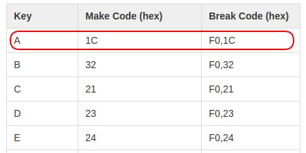
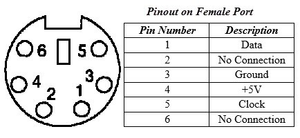
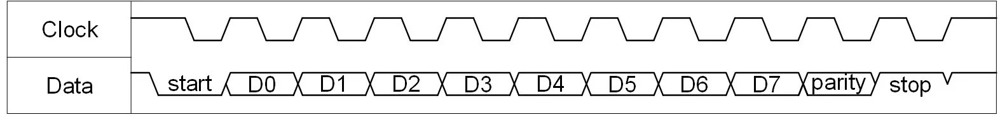
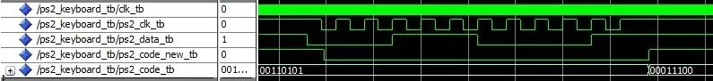

## Archivos asociados ##

Los siguientes archivos son usados para implementar una aplicación que determina el caracter ascii asociado a una tecla presionada en un teclado PS/2. El código fuente para el **PS/2 keyboard to ASCII converter** consiste de los siguientes 3 archivos:
* [ps2_keyboard_to_ascii.vhd](ps2_keyboard_to_ascii.vhd)
* [ps2_keyboard.vhd](ps2_keyboard.vhd)
* [debounce.vhd](debounce.vhd)

### PS/2 Keyboard Interface (VHDL) ###

#### Resumen ####

Este componente recibe las transacciones desde un teclado PS/2 y obtiene los códigos *make code* (key press) y *break code* (key release) a una salida paralela.

#### Código asociado ####

El código asociado se encuentra en el archivo [ps2_keyboard.vhd](ps2_keyboard.vhd)

#### Diagrama de bloques ####

A continuación se muestra entidad asociada al código vhd:

La información de las entradas y las salidas se muestran a continuación:

|Port|Width|Mode|Data Type|Interface|Description|
|----|-----|----|---------|---------|-----------|
|clk|1|in|standard logic|user logic|Reloj del sistema|
|ps2_clk|1|in|standard logic|PS/2 keyboard|Señal de reloj proveniente del teclado PS/2|
|ps2_data|1|in|standard logic|PS/2 keyboard|Señal de datos proveniente del teclado PS/2|
|ps2_code_new|1|out|standard logic|user logic|La flag se encuentra en bajo durante las trabsacciones  PS/2, y una transicion bajo a alto indica que un nuevo codigo se encuentra disponible en el bus ps2_code.|
|ps2_code|8|out|standard logic vector|user logic|Codigo PS/2 de 8 bits recibido desde el teclado.|

La siguiente figura muestra la arquitectura del circuito digital implementado en el código [ps2_keyboard.vhd](ps2_keyboard.vhd):

La siguiente figura muestra los *scan codes* asociados a las diferentes teclas:

Para los **break codes** se antepone una F0 al scan code de la tecla asociada. Observando la figura anterior el **break code** para la tecla **A** (cuyo **scan code** asociado es **1C**) es **0F,1C**. La [Scan Code Set 2](https://www.digikey.com/eewiki/pages/viewpage.action?pageId=28278929#PS/2KeyboardInterface(VHDL)-Appendix:ScanCodeSet2) muestra todos los codigos asociados a las diferentes letras. En la siguiente figura se resalta el caso para la letra **A**:

<!--
Para entender un poco mas lo anterior, supongamos que un usuario presiona la tecla **a** (minúscula). Tal y como se muestra en la tabla [ASCII Character Set]:

El ascii asociado a la letra **a** es la secuencia de bits **1100001 = 0x97**.
-->

#### Entendiendo un poco mas las señales la PS/2 Keyboard Interface ###

**PS/2** (IBM Personal System/2) es una interfaz de teclados y ratones para PC a través de un conector Mini-DIN de 6 pines. La siguiente figura describe cada uno de los pines:

Para el caso, las lineas de reloj (**Clock**) y datos (**Data**) van separadas y siguen el formato de transimisión mostrado a continuación:

La figura anterior se puede analizar en los siguientes pasos:
1. Inicialmente tanto la señal **Clock** como **Data** estan en nivel alto cuando no hay actividad. La señal de reloj (**Clock**) es proporsionada por el teclado y esta entre 10 kHz y 16.7 kHz (es decir, maneja periodos entre 60-100us).
2. Cuando se van a transmitir datos se dan los siguientes eventos:
   * La transmisión de los datos empieza con un **bit de start** colocando la linea **Data** en **0** (Nivel logico bajo).
   * Despues del bit de start se envia un byte de datos, donde el bit LSB es enviado primero.
   * A continuación se encia un bit de paridad (**parity**)
   * Finalmente se envia el bit de **stop** (que emplea logica high) el cual indica que la transacción finalizo. 
   * Una vez se completa la transmision tanto **Clock** como **Data** retornan al nivel logico alto.
3. La lectura de cada uno de los bits se hacen en el flanco de bajada de la señal de reloj.

**Ejemplo de una transacción**

La siguiente figura muestra el diagrama de tiempos para el caso en el cual el usuario presiona la tecla **A** cuyo **scan code set 2** es **1C** (ver el Appendix:  Scan Code Set 2 del siguiente [enlace](https://www.digikey.com/eewiki/pages/viewpage.action?pageId=28278929)).

Como se puede ver de la grafica tenemos los siguientes bits en el bus de datos durante la transmision:
* **start**: 0
* **Data**:
  * **D0**: 0
  * **D1**: 0
  * **D2**: 1
  * **D3**: 1
  * **D4**: 1
  * **D5**: 0
  * **D6**: 0
  * **D7**: 0
* **parity**: 0
* **stop**: 1

Notese además que, la captura se hace en los flancos de bajada de la señal **ps2_clk**. Tambien, se puede ver que cuando empieza la transmisión, la señal **ps2_code_new** baja a 0 y permanece allí mientras la transacción este en proceso. Cuando la transacción se completa, la señal **ps2_clk** sube a 1 indicando que un nuevo codigo PS2 ha sido recibido y esta disponible en el bus **ps2_code**. En este caso, se recibio la secuencia **D0-D1-D2-D3-D4-D5-D6-D7 = 00111000** en la linea **Data**, sin embargo como **D0** es el bit LSB, entonces en **ps2_code** el byte recuperado una vez que la transmisión culmina será **D7-D6-D5-D4-D3-D2-D1-D0 = 00011100 = 0x1C**.

### Debounce Logic Circuit  (VHDL) ###

El uso de switches mecánicos para interfaz de usuario es una práctica común. Sin embargo, cuando estos switches son presionados sus contactos, a menudo rebotan (bounce) una y otra vez antes de alcanzar un estado estable. 

Un módulo anti-debounce puede ser un sistema digital diseñado para corregir este problema. A continuación se muestra la implementación asociada.

#### Código asociado ####

El código asociado se encuentra en el archivo [debounce.vhd](debounce.vhd)

#### Diagrama de bloques ####

A continuación se muestra la entidad asociada a este código vhd:

La información de las entradas y las salidas se muestran a continuación:

|Port|Width|Mode|Data Type|Interface|Description|
|----|-----|----|---------|---------|-----------|
|clk|1|in|standard logic|user logic|Reloj del sistema|
|reset_n|1|in|standard logic|user logic|Reset asincrono activado en bajo|
|button|1|in|standard logic|button or switch|Señal de entrada previa al debounce|
|result|1|out|standard logic|user logic|debounced signal|

El código vhdl describe el siguiente circuito digital:

Para este ejemplo, el debounce es usado dentro del módulo 
ps2_keyboard.vhd para propositos de sincronización

### PS/2 to ASCII Conversion (VHDL) ###

El **PS/2 keyboard to ASCII converter** recibe la secuencia de datos enviadas desde el teclado PS/2 y determina cuales teclas estan siendo presionadas en un momento dado devolviendo el valor ascci (ver seccion **Appendix:  ASCII Character Set** del siguiente [enlace](https://www.digikey.com/eewiki/pages/viewpage.action?pageId=28279002#PS/2KeyboardtoASCIIConverter%28VHDL%29-Appendix:ASCIICharacterSet)) correspondiente a la tecla presionada. 

#### Código asociado ####

El código asociado al **PS/2 keyboard to ASCII converter** consiste en los siguientes 3 archivos: 
1. [debounce.vhd](debounce.vhd): Archivo (analizado anteriormente) en el cual se implementa el circuito de antideboune.
2. [ps2_keyboard.vhd](ps2_keyboard.vhd): archivo (analizado anteriormente) que obtiene a partir de los bits enviados por las linea de Datos, los scan codes asociados a una tecla manipulada. 
3. [ps2_keyboard_to_ascii.vhd](ps2_keyboard_to_ascii.vhd): este es el archivo top level VDHL del conversor. Instancia el teclado PS/2 interface component (ps2_keyboard.vhd) encargado de manejar las transacciones con el teclado y devolver los scan codes asociados a dicha transacción. Los códigos (scan codes) entregados por este componente constituiran las señales de control (entradas) de la FSM del convesor a codigo ascii.

#### Diagrama de bloques ####

El diagrama de bloques de asociado a este módulo se muestra en la siguiente figura:

La operación de la maquina de estados anterior se describe a continuación. 

Una vez se completa el start-up (**begin**) el componente entra al estado **ready** esperando en este estado hasta que recibe un nuevo codigo PS/2 (**ps2_code_new** signal), una vez llega la señal anterior se pasa al estado **new_code**. El estado **new_code** se encarga de construir los *make o break codes* a partir de los datos obtenidos del bus **ps2_code**. En lo que respecta a la transición desde este estado se da de la siguiente manera; si el nuevo codigo recibido es el ultimo byte de un *make o break code* la maquina de estados va al estado **translate**, en caso contrario, retorna al estado **ready** para esperar el próximo byte. Una vez la maquina se encuentra en el estado de **translate**, el convertidor determina cual letra fue presionada obteniendo el valor ascii correspondiente esta. Si el codigo es un *break code* ninguna acción es necesaria asi que el convertidor ignora el codigo y retorna al estado **ready**; sin embargo, si un *make code* es recibido, el convertidor pasa al estado **output** donde las salida del codigo ascii resultante es llevada al bus **ascii_code** y la bandera **ascii_new** es seteada (levada a nivel alto) para indicar que el nuevo codigo esta disponible. Luego el convertidor retorna al estado **ready** para a la espera de la proxima comunicación desde PS/2 la keyboard interface component.

La información de las entradas y las salidas propias de la entidad top ([ps2_keyboard_to_ascii.vhd](ps2_keyboard_to_ascii.vhd)) se muestran a continuación:

|Port|Width|Mode|Data Type|Interface|Description|
|----|-----|----|---------|---------|-----------|
|ascii_code|7|out|standard logic vector|user logic|Codigo ASCII de 7 bits obtenido desde el teclado PS/2|
|ps2_clk|1|in|standard logic|PS/2 keyboard|Señal de reloj proveniente del teclado PS/2|
|ps2_data|1|in|standard logic|PS/2 keyboard|Señal de datos proveniente del teclado PS/2|
|ascii_new|1|out|standard logic|user logic|New code available flag. Esta flag se mantiene en bajo durante las coversiones de PS/2 a ASCCI. Una transición de bajo a alto indica que un nuevo codigo ASCII esta disponible en el bus ascci_code|
|clk|1|in|standard logic|user logic|Reloj del sistema|

A continuación se muestra la máquina de estados implementada en el código [ps2_keyboard_to_ascii.vhd](ps2_keyboard_to_ascii.vhd):

#### Ejemplo de una transacción ####

TRabajando

## Demostración ##

Empleando Vivado, implemente la siguiente aplicación para cuyo caso se dan los siguientes archivos:
* [ps2_keyboard_to_ascii.vhd](ps2_keyboard_to_ascii.vhd)
* [ps2_keyboard.vhd](ps2_keyboard.vhd)
* [debounce.vhd](debounce.vhd)
* [Basys3_Master_demo0KeyBoard.xdc](Basys3_Master_demo0KeyBoard.xdc)

La siguientes imagenes evidencian el funcionamiento de la aplicación para los casos en los que se presionan la A y la Z. ¿Cuál es el significado de la salida que se quiere expresar empleando los leds?

**Letra A**

**Letra Z**

## Notas adicionales ##
Para mas información puede consultar el enlace [PS/2 Keyboard to ASCII Converter (VHDL)](https://www.digikey.com/eewiki/pages/viewpage.action?pageId=28279002)

## Enlaces ##

1. [PS/2 Keyboard Interface (VHDL)](https://www.digikey.com/eewiki/pages/viewpage.action?pageId=28278929)
2. [PS/2 Keyboard to ASCII Converter (VHDL)](https://www.digikey.com/eewiki/pages/viewpage.action?pageId=28279002)
3. [Debounce Logic Circuit (with VHDL example)](https://www.digikey.com/eewiki/pages/viewpage.action?pageId=4980758)
4. [Basys 3 Keyboard Demo](https://reference.digilentinc.com/learn/programmable-logic/tutorials/basys-3-keyboard-demo/start)
5. [Diligent Courses](https://reference.digilentinc.com/learn/courses/start)
6. [Diligent Fundamentals](https://reference.digilentinc.com/learn/fundamentals/start)

<!---
http://www.secs.oakland.edu/~llamocca/Tutorials/VHDLFPGA/
http://www.secs.oakland.edu/~llamocca/Tutorials/VHDLFPGA/Outline.pdf
http://www.secs.oakland.edu/~llamocca/Tutorials/VHDLFPGA/Vivado/

http://ece-research.unm.edu/jimp/vhdl_fpgas/slides/VGA.pdf
http://ece-research.unm.edu/jimp/vhdl_fpgas/
https://academic.csuohio.edu/chu_p/rtl/rtl_hardware.html
https://academic.csuohio.edu/chu_p/rtl/chu_rtL_book/rtl_chap10_fsm.pdf
https://academic.csuohio.edu/chu_p/rtl/fpga_vhdl.html
http://ece-research.unm.edu/jimp/vhdl_fpgas/slides/UART.pdf
http://ece-research.unm.edu/jimp/vhdl_fpgas/modules/divider/divider.vhd
http://ece-research.unm.edu/jimp/vhdl_fpgas/slides/FSM.pdf
http://ece-research.unm.edu/jimp/vhdl_fpgas/slides/sequential_design.pdf
http://ece-research.unm.edu/jimp/vhdl_fpgas/slides/sequential_principle.pdf

https://ece.gmu.edu/coursewebpages/ECE/ECE448/S13/
http://ebook.pldworld.com/_eBook/FPGA%EF%BC%8FHDL/

-->
