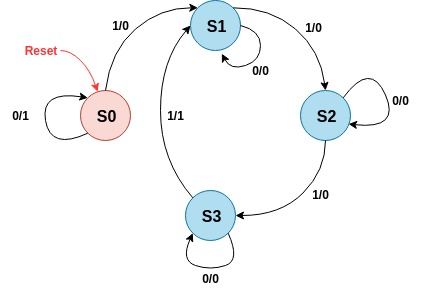
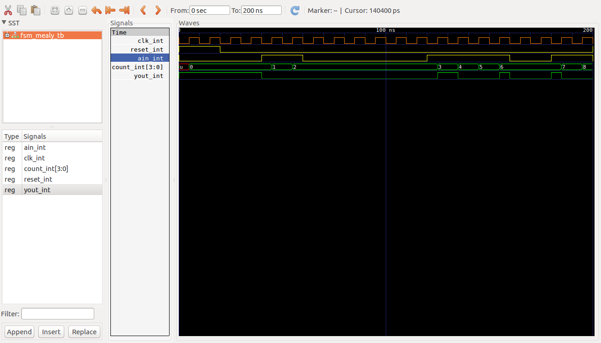

# Maquina Mealy ##

## Maquina Mealy 2 bloques ##


## Ejemplo ##

### Enunciado ###

Design a sequence detector implementing a Mealy state machine using three always blocks. The Mealy state machine has one input (ain) and one output (yout). The output yout is 1 if and only if the total number of 1s received is divisible by 3 (hint: 0 is inclusive, however, reset cycle(s) do not count as 0- see in simulation waveform time=200). Develop a testbench and verify the model through a behavioral simulation. Use SW0 as the clock input, SW1 as the ain input, the BTNU button as reset input to the circuit, number of 1s count on LED7:LED4, and LED0 as the yout output. Go through the design flow, generate the bitstream, and download it into the Nexys3 board. Verify the functionality.


### Diagrama de estados de la solución ###



### Comandos de compilación en ghdl ###

```bash
ghdl -a --ieee=synopsys -fexplicit mealy1.vhd 
ghdl -a --ieee=synopsys -fexplicit mealy1_tb.vhd
ghdl -r --ieee=synopsys -fexplicit  FSM_MEALY_TB --stop-time=200ns --vcd=FSM_MEALY_TB_results.vcd
gtkwave FSM_MEALY_TB_results.vcd
```

### Resultados  ###




