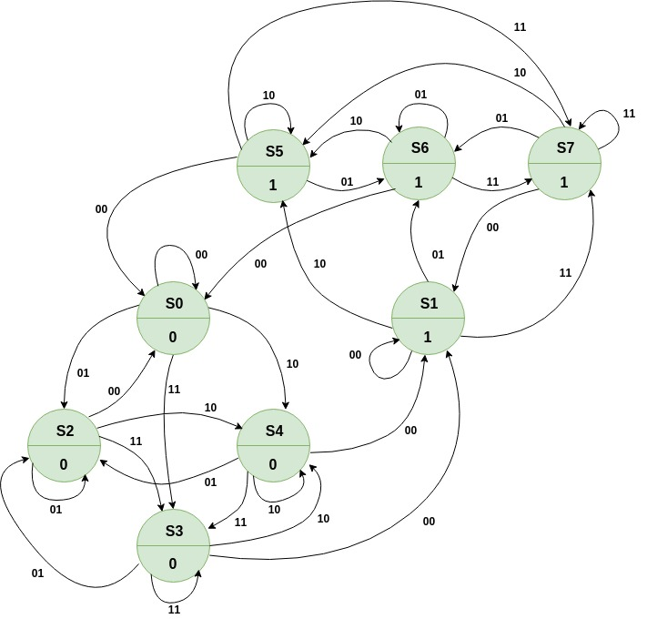
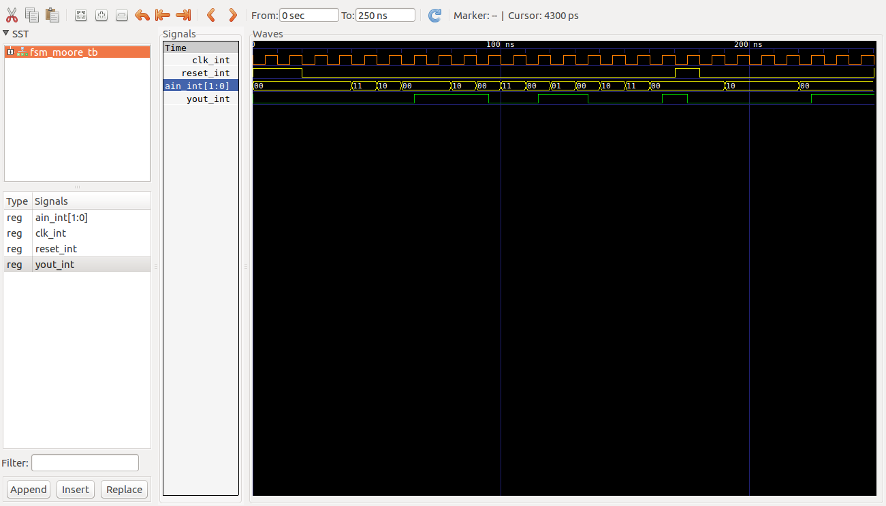

# Maquina Mealy ##

## Maquina Mealy 3 bloques ##


## Ejemplo ##

### Enunciado ###


Design a sequence detector implementing a Moore state machine using three always blocks. The Moore state machine has two inputs (ain[1:0]) and one output (yout). The output yout begins as 0 and remains a constant value unless one of the following input sequences occurs:
1. The input sequence ain[1:0] = 01, 00 causes the output to become 0
2. (ii) The input sequence ain[1:0] = 11, 00 causes the output to become 1
3. The input sequence ain[1:0] = 10, 00 causes the output to toggle.

Develop a testbench (similar to the waveform shown below and verify the model through a behavioral simulation. Use SW0 as the clock input, SW2-SW1 as the ain[1:0] input, the BTNU button as reset input to the circuit, and
LED0 as the yout output. Go through the design flow, generate the bitstream, and download it into the Nexys3 board. Verify the functionality.

### Diagrama de estados de la solución ###



### Comandos de compilación en ghdl ###

```bash
ghdl -a --ieee=synopsys -fexplicit moore.vhd 
ghdl -a --ieee=synopsys -fexplicit moore_tb.vhd
ghdl -r --ieee=synopsys -fexplicit  FSM_MOORE_TB --stop-time=250ns --vcd=FSM_MOORE_TB_results.vcd
gtkwave FSM_MOORE_TB_results.vcd
```

### Resultados  ###




https://docs.google.com/a/udea.edu.co/viewer?a=v&pid=sites&srcid=ZGVmYXVsdGRvbWFpbnxlbGVjdHJvbmljYWRpZ2l0YWwxMTd8Z3g6YmJlYWQ0NDRkOWUxNDMz


https://docs.google.com/a/udea.edu.co/viewer?a=v&pid=sites&srcid=ZGVmYXVsdGRvbWFpbnxlbGVjdHJvbmljYWRpZ2l0YWwxMTd8Z3g6MWI3Y2MwMzYwNzZkZWU0Mw


----


https://www.studocu.com/es/document/universidad-rey-juan-carlos/estructura-de-computadores/ejercicios-obligatorios/tema08-ejercicios-sistemas-secuenciales/3398505/view

http://repositorio.upct.es/bitstream/handle/10317/124/Descarga.pdf?sequence=1&isAllowed=y

https://www.dte.us.es/docencia/etsii/gii-is/circuitos-electronicos-digitales/grupo-5/Tema6-CircuitosSecuencialesSincronos.pdf

http://courses.cs.tamu.edu/rabi/cpsc617/Assignments/Assignments%202013/Tutorial%20Three%20Cycle%20High%20Timer.pdf


https://stackoverflow.com/questions/22058953/vhdl-state-machine-testbench

http://www.csit-sun.pub.ro/courses/Masterat/Xilinx%20Synthesis%20Technology/toolbox.xilinx.com/docsan/xilinx4/data/docs/xst/hdlcode15.html